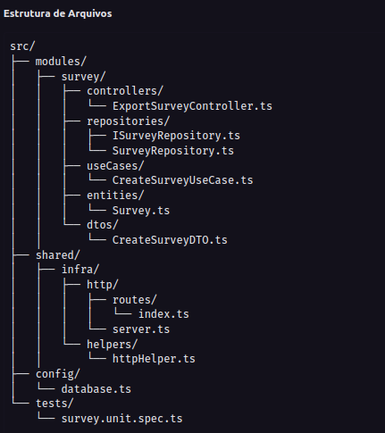

Teste Desenvolvedor backend

1. instale as dependências
   1. **npm i | yarn**
2. suba o banco de dados
   1. **docker compose up**
3. rode as migrations
   1. **npx prisma migrate dev**
4. rode os testes
   1. **npm run test**

A estrutura modularizada ajuda a manter o código organizado e facilita a manutenção e escalabilidade do projeto. Cada módulo é responsável por uma parte específica da aplicação, e o uso de pastas como `controllers`, `repositories`, `useCases`, `entities` e `dtos` dentro de cada módulo ajuda a separar claramente as responsabilidades.

